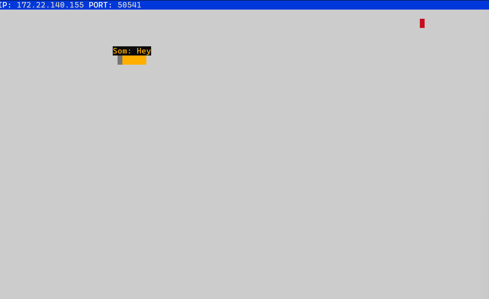
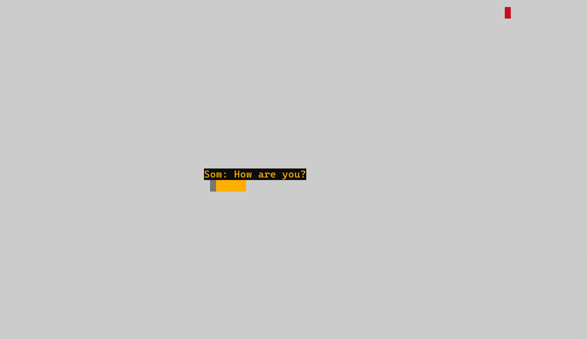

# Snake Client Project

## Description

Snake game is a very popular video game. It is a video game concept where the player maneuvers a dot and grows it by ‘eating’ pieces of food. As it moves and eats, it grows and the growing snake becomes an obstacle to smooth maneuvers. The goal is to grow it to become as big as possible without bumping into the side walls, or bumping into itself, upon which it dies.

This client application is simply a multiplayer take on the genre. The client connects to a server and allows players to control their snake and communicate with other players.

Before you can run this client, you will need to be running the server side. (Navigate to the `snek-multiplayer` directory to find the server files.)

## Final Product

Initial view when the server starts:


Your snake appears on the game board:


Chatting with other players using predefined commands:


## Features

- **Movement Controls**: Use W, A, S, D or arrow keys to move your snake up, left, down, and right.
- **Chat Feature**: Send messages to other players using predefined commands.
- **Real-time Updates**: Receive real-time updates from the server.

## Installation

1. **Clone the repository:**

    ```bash
    git clone https://github.com/Somtico/snake-client
    ```

2. **Navigate to the project directory:**

    ```bash
    cd snake-client
    ```

3. **Install dependencies:**

    ```bash
    npm install
    ```

## Usage

1. **Navigate to the server directory and start the server application:**

    ```bash
    cd snek-multiplayer/ 
    npm run play
    ```

2. **Open a new terminal, navigate to the root directory (/snake-client) and start the client application:**

    ```bash
    node play.js
    ```

3. **Once connected, you'll see a message indicating a successful connection to the game server.**

4. **Use the following controls to interact with the game:**

    - **Movement Controls**: Use W, A, S, D or arrow keys.
    - **Chat Commands**: 
      - **H**: "Say: Hello!"
      - **I**: "Say: I'm doing well. You?"
      - **Q**: "Say: How are you?"
      - **Y**: "Say: Yes!"

## Configuration

- **Server Address**: You can configure the server address and port in the `constants.js` file. Update `IP` and `PORT` to match your server's settings.

- **Name Identifier**: In the `client.js` file, find the "Name: Som" line and replace "Som" with your initials or the first three letters of your name. (It only takes a maximum of 3 characters).
  
## Dependencies

- `net`: Built-in Node.js module for network operations.

## Contributing

If you'd like to contribute to this project, please fork the repository and submit a pull request.

## License

This project is licensed under the MIT License. See the [LICENSE](./snek-multiplayer/LICENSE) file for details.
